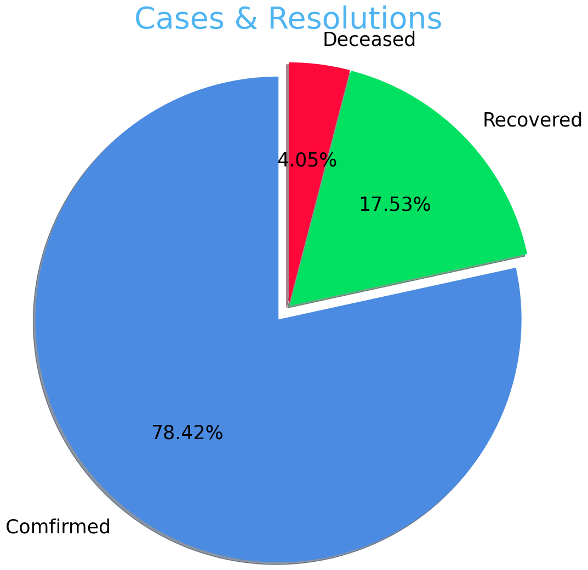

AIM
Analysing spread of Covid-19 overtime in Maharashtra,India

INITIAL DATA INVESTIGATION
Initial data survey showcased two clean and simple datasets, 'case_time_series' holding passage of time bewteen 30th of January 2020 to the 13th of May 2020 and all the data related to cases during that time & 'district' having case data divided up by district. Knowing how the data is divided up, the next step is loading the files into python and creating charts based on their organisation

PYTHON CODING
Three simple charts will be created, one using the 'case_time_series' dataset & two using the 'district' dataset:

'case_time_series'
1-A line chart shocasing the progress of contamination over the year

'district'
1-A bar chart showcasing the total cases per district and their resolutions(If available)
2-A pie chart showing the percentage of resolution of cases

CREATED CHARTS

CONCLUSION
As we are all very aware, 2020 was devasted by the high number of cases and India was not spared, the numbers on the charts created reminding us of this fact; In addition, just like it was being said at the time worldwide, the mortality rate shown is this data is relativly low (Below 5%).